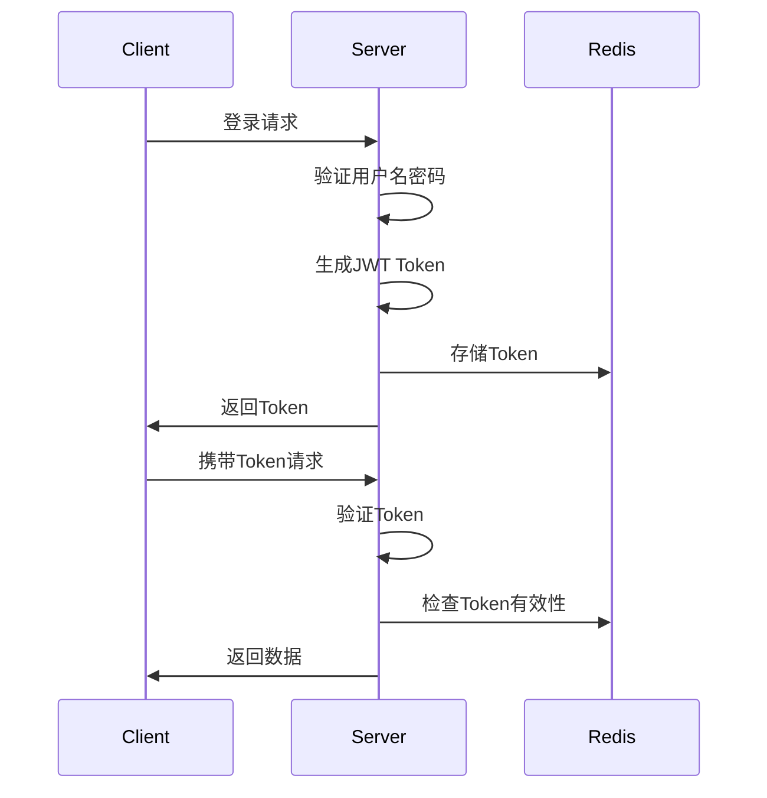

# Spring Boot + Vue.js 积分管理系统

## 项目概述
这是一个基于 Spring Boot 和 Vue.js 的积分管理系统，实现了用户管理、积分管理、积分日志等功能。系统采用前后端分离架构，使用 JWT 进行身份认证和授权。

## 技术栈

### 后端技术栈
- **Spring Boot 3.x**: 快速开发框架，提供自动配置、依赖注入等功能
- **MyBatis**: ORM框架，用于数据库操作
- **PageHelper**: MyBatis分页插件，实现分页查询
- **JWT (JSON Web Token)**: 用于身份认证和授权
- **Redis**: 用于存储JWT令牌和黑名单
- **MySQL**: 关系型数据库，存储业务数据
- **Lombok**: 简化Java代码，自动生成getter/setter等方法
- **Maven**: 项目构建和依赖管理工具

### 前端技术栈
- **Vue 3**: 渐进式JavaScript框架
- **Vue Router**: 前端路由管理
- **Pinia**: 状态管理库
- **Element Plus**: UI组件库
- **Axios**: HTTP客户端，用于API请求
- **Vite**: 前端构建工具

## 核心功能

### 1. 用户管理
- 用户注册和登录
- 用户信息管理
- 用户角色控制（管理员/普通用户）
- 用户状态管理（启用/禁用）

### 2. 积分管理
- 积分记录
- 积分查询
- 积分统计
- 积分变动日志

### 3. 安全特性
- JWT认证
- 基于角色的访问控制
- 密码加密存储
- Token自动续期
- Token黑名单机制

## 技术实现细节

### 1. JWT认证流程


### 2. 数据库设计
- **users表**: 存储用户信息
- **points表**: 存储积分记录
- **point_logs表**: 存储积分变动日志

### 3. 权限控制
- 使用JWT中的claims存储用户角色信息
- 基于注解的权限控制
- 动态路由权限控制

### 4. 性能优化
- 使用Redis缓存JWT令牌
- 分页查询优化
- 数据库索引优化

## 项目结构
```
springDemo/
├── src/
│   ├── main/
│   │   ├── java/
│   │   │   └── com/example/springdemo/
│   │   │       ├── config/        # 配置类
│   │   │       ├── controller/    # 控制器
│   │   │       ├── mapper/        # MyBatis接口
│   │   │       ├── pojo/          # 实体类
│   │   │       ├── service/       # 服务层
│   │   │       └── utils/         # 工具类
│   │   └── resources/
│   │       ├── mapper/            # MyBatis映射文件
│   │       └── application.yml    # 配置文件
│   └── test/                      # 测试代码
└── front-end/                     # 前端项目
    ├── src/
    │   ├── api/                   # API请求
    │   ├── components/            # 组件
    │   ├── router/                # 路由配置
    │   ├── stores/                # 状态管理
    │   └── views/                 # 页面
    └── package.json               # 依赖配置
```

## 部署说明
1. 后端部署
   - 配置数据库连接
   - 配置Redis连接
   - 配置JWT密钥
   - 打包并运行Spring Boot应用

2. 前端部署
   - 配置API地址
   - 构建生产环境代码
   - 部署到Web服务器

## 开发环境要求
- JDK 17+
- Node.js 16+
- MySQL 8.0+
- Redis 6.0+

## 注意事项
1. 生产环境部署时请修改默认密码
2. 定期备份数据库
3. 注意JWT密钥的保密性
4. 合理设置Redis过期时间

## 贡献指南
1. Fork 项目
2. 创建特性分支
3. 提交更改
4. 推送到分支
5. 创建Pull Request

## 许可证
MIT License 